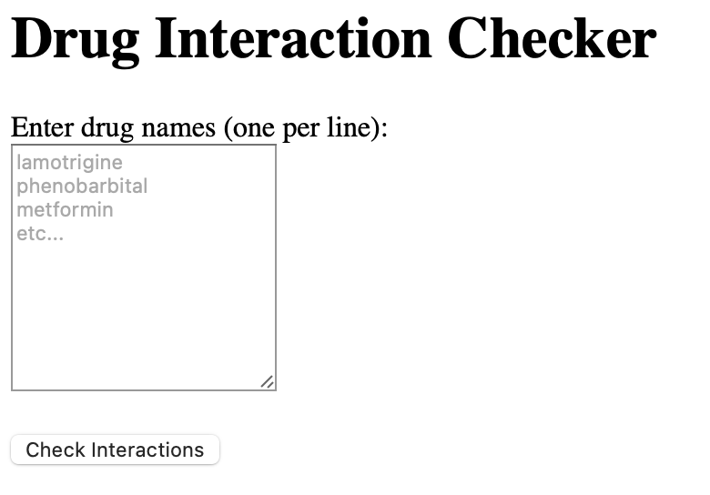
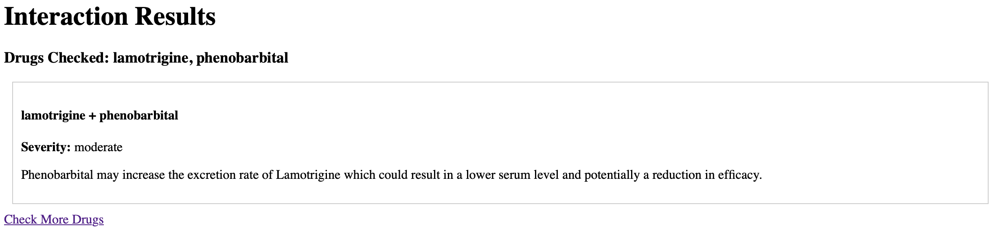

# CS6620-Final-Project
A cloud-based proof of concept and minimum viable product for a drug interaction checker built with LocalStack AWS, Terraform, and a mock DrugBank API. Project assignment for CS6620 (Cloud Computing) at the Roux Institute at Northeastern.

## *For TA: Assignment Tasks*
0. Project proposal
    * Please see `docs/proposal.pdf` [here](https://github.com/charVANder/CS6620-Final-Project/blob/main/docs/proposal.pdf).
1. Present initial problem statement and its constituent tasks. The initial problem statement might resemble an epic and the tasks should take the form of user stories (like "As a _____ I need ____ so I can ____").
    * Please see `docs/statement_and_tasks.pdf` [here](https://github.com/charVANder/CS6620-Final-Project/blob/main/docs/statement_and_tasks.pdf).
    * The Kanban/issues project board created from this can also be viewed. It is private, but I can provide access or show an image of it as needed.
2. Present cloud architecture diagram(s), include explanations about alternatives and their tradeoffs.
    * Please see `docs/architecture.pdf` [here](https://github.com/charVANder/CS6620-Final-Project/blob/main/docs/architecture.pdf).
3. You can see my notebook on how I parsed the academic license data via the DrugBank Schema in `docs/parsing_data.html` (just download the file and double click on it)
4. Create the proof of concept
    * Can be displayed through MVP using only 2 drugs. Will use the `demo/test_poc.txt` drugs found [here](https://github.com/charVANder/CS6620-Final-Project/blob/main/demo/test_poc.txt).
5. Create the MVP
    * Can be displayed by going though list of drugs. Will use the `demo/test_mvp.txt` drugs found [here](https://github.com/charVANder/CS6620-Final-Project/blob/main/demo/test_mvp.txt).
6. Prepare Presentation
    * Please see `docs/presentation.pdf` [here]().

## Setup
Assuming that you have Docker running, here is how to run the setup script:
```bash
chmod +x setup.sh
./setup.sh
```
This script starts LocalStack, packages the Flask app with dependencies, and deploys the complete serverless infrastructure with Terraform.

## Testing the POC and MVP
After the setup script finishes running, your terminal should output an API Gateway URL. Copy this URL and use it to open up a new tab in your browser. Doing this should take you to the main Drug Interaction Checker home page (see image below)
<p float="left", align="center">
  
</p>

### *POC:*
To test out the POC with two drugs (using `demo/test_poc.txt`), copy/paste the following into the text area and press `Check Interactions`
```bash
lamotrigine
phenobarbital
```
This should take you to the results page with information on the interaction between both of those drugs (see image below). Clicking the `Check More Drugs` link should then take you back to the main home page.
<p float="left", align="center">
  
</p>

### *MVP:*
To test out the MVP with multiple drugs (using `demo/test_mvp.txt`), copy/paste the folowing into the text area and press `Check Interactions`
```bash
warfarin
metformin
lamotrigine
lorazepam
phenobarbital
simvastatin
omeprazole
oxcarbazepine
levetiracetam
```
NOTE: This will take a little bit longer to reach the results page as program must cross-reference between all possible drug-pair interactions.

## References and AI Appendix
* DrugBank data and data schema
    * Knox C, Wilson M, Klinger CM, et al.DrugBank 6.0: the DrugBank Knowledgebase for 2024.Nucleic Acids Res. 2024 Jan 5;52(D1):D1265-D1275. doi: 10.1093/nar/gkad976.
* Lambda Function HTTP invoke methods: https://docs.aws.amazon.com/lambda/latest/dg/apig-http-invoke-decision.html
* Testing AWS infrastructure w/ LocalStack and Terraform: https://docs.aws.amazon.com/prescriptive-guidance/latest/patterns/test-aws-infra-localstack-terraform.html
* Lambda and IAM: https://docs.aws.amazon.com/lambda/latest/dg/security_iam_service-with-iam.html
*  Lambda Function URLs with LocalStack: https://docs.localstack.cloud/aws/services/lambda/#trigger-the-lambda-function-url
* Pytest fixtures: https://docs.pytest.org/en/6.2.x/fixture.html
* Unittest "b": https://stackoverflow.com/questions/25069017/using-unittest-what-is-b-self-asserttruebplease-login
* Simulating API timeouts with a mock API: https://zuplo.com/learning-center/mock-apis-to-simulate-timeouts
* Flask-cors issue: https://github.com/corydolphin/flask-cors/issues/252
* Installing Docker Compose in GitHub Actions: https://claude.ai/share/f735d8d5-aaf6-4504-9967-485bbe40b7a6
* Fixing my LocalStack/API Gateway integration issue. Terraform/LocalStack configuration was working, API Gateway was created successfully, and direct API calls were successful, but the generated URLs wouldn't work properly in browsers due to unknown CORS or routing issues: https://claude.ai/share/7d0e9590-b892-4945-ac61-f2ca30a9e5fe
* Asking AI about terraform template examples for serverless architecture: https://claude.ai/share/eef1e2fa-5643-4052-bed2-9446ab885fab