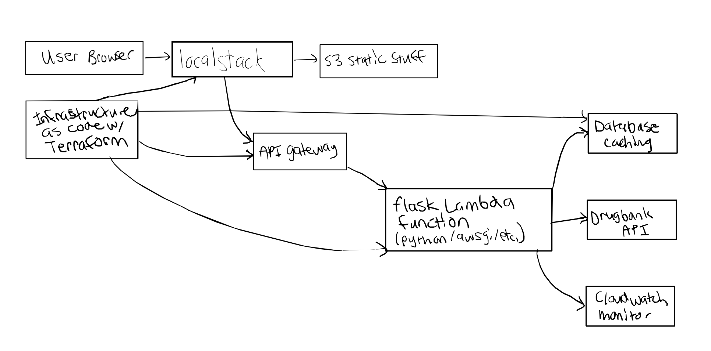

# Project Architecture
## Cloud Architecture Diagram and Overview
This project implements a serverless architecture using AWS services emulated locally with LocalStack. There is the static web interface layer, then there is the application layer consisting of a Flask Lambda function, and finally, there is the data layer which includes a DynamoDB cache plus external API. An image of the initial cloud architecture diagram is shown below (changes were later made to use a mock DrugBank API due to pricing):

  

The users interact with the web form hosted on an S3 static website which then submits requests to API Gateway. API Gateway routes these request to a Lambda function running the Flask app, which then processes the drug names, checks for cached results in DynamoDB, and calls the mock DrugBank API for any new interactions. The Lambda function makes use of an n-choose-2 algorithm to check all the possible drug pair combinations, caches results (hopefully to improve performance and reduce API costs), and then returns the formatted data through the API Gateway to the user browser.

## Database Alternatives Analysis
After trial and error, DynamoDB was chosen for the database layer mostly due to it minimal setup requirements on LocalStack and simple key-value storage which was perfect for caching drug interaction pairs. It was also serverless and good for automatic scaling. Amazon RDS was also considered but ultimately rejected due to managing connections with Lambda and also the fact that it felt like an overkill for only the simple cache needs this project required. ElastiCache did offer fast performance, however, I felt that it added unnecessary complexity for a simple POC/MVP. There was also limited LocalStack support.

## Compute Alternatives Analysis
For compute options, Lambda was selected over EC2 for multiple reasons. First, the pay-per-request pricing model was ideal for drug checking usage which is often sporadic. Next, both automatic scaling and server management was a lot simpler. And finally, there was the seamless LocalStack Integration. EC2 required more running costs and manual scaling configurations which seemed a bit complex for a simple drug checking service. API Gateway was also chosen over the direct Lambda call to provide the necessary HTTP routing and a RESTful interface that could easily migrate to production AWS services.

## Mock API Strategy
Throughout this project, there were a few hurdles when it came to receiving access to DrugBank's API--even with the academic license. I was able to get access to DrugBank's academic license downloads data and schema, but making actual API calls with a development API key would have cost around $5,000 which was too much for a class project. Therefore, a mock DrugBank API was implemented to address those limitations during development while also maintaining similar interfaces to the real service. This mock API makes use of real existing drug interaction data in JSON format, simulates response delays, and provides test coverage. Alternative approaches I also considered were hard-coding responses (which would have been too inflexible in my opinion) or waiting longer for DrugBank API access (which would have risked my project timeline). The mock API strategy was the best way to preserve application logic while also enabling production migration in the future by changing the API endpoint URL.
